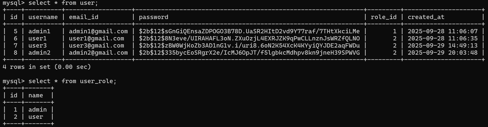

# Secure Login System

## Overview
The Secure Login System (SLS) is a web application designed to provide safe and reliable user authentication. It uses Flask for the backend and MySQL for storing user data, while Bcrypt ensures passwords are securely encrypted. JWT tokens are used for managing sessions, and Google reCAPTCHA protects the system from bots and automated attacks. The project focuses on creating a simple yet secure login process that can be applied to websites, portals, or any platform that requires user verification.

---

## Features
- Passwords are encrypted using Bcrypt for strong protection.
- JWT tokens are used to manage user sessions safely.
- User credentials are stored and managed in a MySQL database.
- Google reCAPTCHA is integrated to block bots and automated attacks.
- A role based access is implemented:
  - Admin can promote/demote user, delete accounts, track user login/logout time.
  - Users can view their dashboard. 
---

## Screenshots
### Login Page


### Registration Page


### User Dashboard


### Admin Dashboard


### Activity Dashboard 


### reCAPTCHA


### About


### Database


### Activity Table


## Project Structure
```bash
secure_login_sys/
├── README.md                 
├── requirements.txt          
├── report.pdf                
├── codes/                    
│   ├── app.py                
│   ├── config.py             
│   ├── query.txt            
│   ├── static/               
│   │   ├── style.css
│   │   ├── passvalid.js
│   │   └── vt_assets/        
│   │       ├── about_page.png
│   │       ├── admin_dash.png
│   │       ├── activity_table.png
│   │       ├── activity_dashboard.png
│   │       ├── loginpage.png
│   │       ├── recaptca_proof.png
│   │       ├── reg_page.png
│   │       ├── user_dash.png
│   │       ├── user_db.png
│   └── templates/            
│       ├── index.html
│       ├── about.html
│       ├── register.html
│       ├── admin_dashboard.html
│       └── login_activity.html

```
---
## Setup Instructions

### 1. Clone the repository
```bash
git clone https://github.com/krtk21/secure_login_sys
cd secure_login_sys
```

### 2. Install dependencies
```bash
pip install -r requirements.txt
```
## 3. Setup mysql
Create a database in mysql
```sql
cretate database vault;
```
Create table named user_role
```sql
 CREATE TABLE user_role(
  id int PRIMARY KEY  AUTO_INCREMENT NOT NULL,
  name varchar(50) UNIQUE NOT NULL
)
```
Create table named user
```sql
CREATE TABLE user (
  id INT NOT NULL AUTO_INCREMENT,
  username VARCHAR(100) NOT NULL,
  email_id VARCHAR(150) NOT NULL,
  password VARCHAR(255) NOT NULL,
  role_id INT NOT NULL,
  created_at TIMESTAMP NULL DEFAULT CURRENT_TIMESTAMP,
  PRIMARY KEY (id),
  UNIQUE KEY username (username),
  UNIQUE KEY email_id (email_id),
  KEY role_id (role_id),
  CONSTRAINT user_ibfk_1 FOREIGN KEY (role_id) REFERENCES user_role (id));
```
Create table named login_activity
```sql
CREATE TABLE login_activity (
  id INT NOT NULL AUTO_INCREMENT,
  user_id INT DEFAULT NULL,
  username_snapshot VARCHAR(100) DEFAULT NULL,
  login_time TIMESTAMP NULL DEFAULT CURRENT_TIMESTAMP,
  logout_time TIMESTAMP NULL DEFAULT NULL,
  PRIMARY KEY (id),
  KEY user_id (user_id),
  CONSTRAINT login_activity_ibfk_1 FOREIGN KEY (user_id) REFERENCES user (id) ON DELETE SET NULL
);

```
### 4. Configure Database in app.py

Update this function with mysql credentials:

```python
conn = mysql.connector.connect(
    host="localhost",
    user="root",
    password="your_password",
    database="vault"
)
cursor = conn.cursor(dictionary=True)
```
### 5. Run the Application

```bash
python codes/app.py
```
The app will run at:
```cpp
http://127.0.0.1:5000/

```


